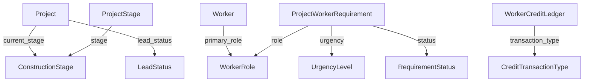

# Master Data Reference Guide

This document lists all master (lookup/reference) table data that is loaded into the system.

---

## 🏗️ Construction Stages (15 Stages)

Sequential stages in a construction project lifecycle:

| Code | Name | Sequence | Priority | Description |
|------|------|----------|----------|-------------|
| SITE_PREP | Site Preparation | 1 | 3 | Land clearing, leveling, and initial site work |
| FOUNDATION | Foundation Work | 2 | 5 | Excavation, footings, and foundation laying |
| PLINTH | Plinth Beam | 3 | 4 | Plinth level beams and DPC work |
| COLUMNS | Column Casting | 4 | 4 | Ground floor column work |
| SLAB_GF | Ground Floor Slab | 5 | 5 | Ground floor slab and beam work |
| BRICKWORK | Brickwork Masonry | 6 | 4 | Wall construction with bricks/blocks |
| ROOF | Roof Slab | 7 | 5 | Terrace/roof slab casting |
| PLASTER | Plastering | 8 | 3 | Internal and external wall plastering |
| FLOORING | Flooring Work | 9 | 4 | Tiles, marble, or concrete flooring |
| ELECTRICAL | Electrical Work | 10 | 3 | Wiring, switches, and electrical fittings |
| PLUMBING | Plumbing Work | 11 | 3 | Water supply and sanitation piping |
| DOORS_WINDOWS | Doors & Windows | 12 | 3 | Door and window frame installation |
| PAINTING | Painting | 13 | 2 | Interior and exterior painting |
| FINISHING | Finishing Work | 14 | 3 | False ceiling, final fixtures, and fittings |
| HANDOVER | Handover & Cleanup | 15 | 1 | Final cleanup and project handover |

---

## 🎯 Lead Statuses (10 Statuses)

Project/Lead lifecycle stages:

| Code | Name | Sequence | Final? | Won? | Lost? |
|------|------|----------|--------|------|-------|
| NEW | New Lead | 1 | No | No | No |
| CONTACTED | Contacted | 2 | No | No | No |
| SITE_VISIT | Site Visit Done | 3 | No | No | No |
| QUOTE_SENT | Quotation Sent | 4 | No | No | No |
| NEGOTIATION | Under Negotiation | 5 | No | No | No |
| WON | Won - Active Project | 6 | ✅ Yes | ✅ Yes | No |
| LOST_PRICE | Lost - Price Issue | 7 | ✅ Yes | No | ❌ Yes |
| LOST_COMPETITOR | Lost - Competitor Won | 8 | ✅ Yes | No | ❌ Yes |
| LOST_TIMING | Lost - Timing Mismatch | 9 | ✅ Yes | No | ❌ Yes |
| CANCELLED | Cancelled by Client | 10 | ✅ Yes | No | ❌ Yes |

**Usage:**
- `is_won=True`: Revenue opportunities (active projects)
- `is_lost=True`: Lost opportunities (analyze reasons)
- `is_final=True`: Terminal states (no further progression)

---

## 👷 Worker Roles (15 Roles)

Types of workers/contractors in the network:

| Code | Name | Active |
|------|------|--------|
| MASON | Mason | ✅ |
| CARPENTER | Carpenter | ✅ |
| PLUMBER | Plumber | ✅ |
| ELECTRICIAN | Electrician | ✅ |
| PAINTER | Painter | ✅ |
| WELDER | Welder | ✅ |
| TILE_LAYER | Tile Layer | ✅ |
| STEEL_FIXER | Steel Fixer | ✅ |
| CONCRETE_WORKER | Concrete Worker | ✅ |
| EXCAVATOR_OP | Excavator Operator | ✅ |
| CRANE_OP | Crane Operator | ✅ |
| HELPER | General Helper | ✅ |
| SUPERVISOR | Site Supervisor | ✅ |
| FOREMAN | Foreman | ✅ |
| CONTRACTOR | Sub-Contractor | ✅ |

---

## 📌 Requirement Statuses (5 Statuses)

Worker requirement lifecycle:

| Code | Name | Description |
|------|------|-------------|
| OPEN | Open - Unfilled | Worker needed, not yet assigned |
| ASSIGNED | Assigned | Worker assigned to requirement |
| IN_PROGRESS | Work In Progress | Worker actively working |
| COMPLETED | Completed | Work finished successfully |
| CANCELLED | Cancelled | Requirement cancelled |

**Workflow:**
```
OPEN → ASSIGNED → IN_PROGRESS → COMPLETED
  ↓
CANCELLED (can happen at any stage)
```

---

## ⚡ Urgency Levels (5 Levels)

Priority scoring for requirements:

| Code | Name | Priority Score | When to Use |
|------|------|----------------|-------------|
| LOW | Low Priority | 1 | Future planning, 30+ days out |
| MEDIUM | Medium Priority | 3 | Normal scheduling, 15-30 days |
| HIGH | High Priority | 5 | Immediate need, 7-14 days |
| URGENT | Urgent | 8 | Critical path, 2-7 days |
| CRITICAL | Critical | 10 | Emergency, < 2 days |

**Priority Score Impact:**
- Used in stage priority calculations
- Affects worker matching scores
- Drives assignment recommendations

---

## 💳 Credit Transaction Types (7 Types)

Types of credit ledger entries:

| Code | Name | Impact | Description |
|------|------|--------|-------------|
| CREDIT_ISSUE | Credit Issued | Debit (−) | Material/service provided on credit |
| PAYMENT_RECEIVED | Payment Received | Credit (+) | Full payment received |
| PAYMENT_PARTIAL | Partial Payment | Credit (+) | Partial payment received |
| CREDIT_ADJUSTMENT | Credit Adjustment | ± Both | Manual adjustment/correction |
| WRITEOFF | Bad Debt Write-off | Credit (+) | Uncollectable debt written off |
| INTEREST_CHARGE | Interest Charged | Debit (−) | Interest on overdue balance |
| LATE_FEE | Late Payment Fee | Debit (−) | Penalty for late payment |

**Balance Calculation:**
```
Outstanding Balance = Credits(+) - Debits(−)
Negative balance = Worker owes money (risk)
Positive balance = Advance payment received
```

---

## 📋 Loading Master Data

### First Time Setup
```bash
python manage.py loadmasterdata
```

### Reset and Reload (if data corrupted)
```bash
python manage.py loadmasterdata --reset
```

**Warning:** `--reset` flag will DELETE all existing master data before reloading!

---

## 🔄 Database Reset Workflow

When resetting the entire database:

```bash
# Step 1: Delete database file (SQLite)
rm maincore.sqlite3

# Step 2: Run migrations
python manage.py migrate

# Step 3: Load master data
python manage.py loadmasterdata

# Step 4: Create admin user (if needed)
python manage.py createadminuser
```

---

## 🛡️ Master Data Protection

**Important Rules:**
1. **NEVER delete master data** in production - other tables reference these
2. **Use `is_active=False`** instead of deleting (for WorkerRole, ConstructionStage)
3. **Backup before reset** - master data customizations will be lost
4. **Add new entries** rather than modifying existing codes

---

## 📊 Master Data Dependencies



**Key Constraints:**
- `Project.current_stage` → `ConstructionStage` (PROTECT)
- `Project.lead_status` → `LeadStatus` (PROTECT)
- Cannot delete master records with active references

---

## ✅ Verification

After loading master data, verify counts:

```python
from objectbank.models import *

print(f"Construction Stages: {ConstructionStage.objects.count()}")  # Should be 15
print(f"Lead Statuses: {LeadStatus.objects.count()}")              # Should be 10
print(f"Worker Roles: {WorkerRole.objects.count()}")               # Should be 15
print(f"Requirement Statuses: {RequirementStatus.objects.count()}")# Should be 5
print(f"Urgency Levels: {UrgencyLevel.objects.count()}")           # Should be 5
print(f"Credit Transaction Types: {CreditTransactionType.objects.count()}") # Should be 7
```

---

## 🔧 Customization

To add more master data entries:

1. Edit `objectbank/management/commands/loadmasterdata.py`
2. Add entries to respective lists
3. Run `python manage.py loadmasterdata`
4. Existing entries will be skipped (based on `code` field)

**Example:** Adding a new worker role
```python
{'code': 'AC_TECH', 'name': 'AC Technician', 'is_active': True}
```

---

**Last Updated:** February 12, 2026  
**Version:** 1.0
